Введение
--------

Рекомендательные системы появились в интеренете достаточно давно, около 20 лет
назад. Однако настоящий подъем в этой области случился примерно 5-10 лет назад,
когда произошло соревнование Netflix Prize. Компания Netflix тогда давала в
прокат не цифровые копии, а рассылала VHS-кассеты и DVD. Для них было очень
важно повысить качество рекомендаций. Чем лучше Netflix рекомендует своим
пользователям фильмы, тем больше фильмов они берут в прокат. Соответственно,
растет и прибыль компании. В 2006 году они запустили соревнование Netflix Prize.
Они выложили в открытый доступ собранные данные: около 100 миллионов оценок по
пятибалльной шкале с указанием ID проставивших их пользователей. Участники
соревнования должны были как можно лучше предугадывать, какую оценку поставит
определенному фильму тот или иной пользователь. Качество предсказания измерялось
при помощи метрики  средне-квадратичное отклонение. У Netflix уже был алгоритм,
который предсказывал оценки пользователей с качеством 0.9514 по данной метрике.
Задача была улучшить предсказание хотя бы на 10% — до 0.8563. Победителю был
обещан приз в \$ 1 000 000. Соревнование длилось примерно три года. За первый
год качество улучшили на 7%, дальше все немного замедлилось. Но в конце две
команды с разницей в 20 минут прислали свои решения, каждое из которых проходило
порог в 10%, качество у них было одинаковое с точностью до четвертого знака. В
задаче, над которой множество команд билось три года, все решили каких-то
двадцать минут. Опоздавшая команда (как и многие другие, участвовавшие в
конкурсе) остались ни с чем, однако сам конкурс очень сильно подстегнул развитие
в этой области.

На сегоднешний день на множестве сайтов внедрены рекомендалтельные системы. В
пример можно привести imdb.com где пользователи могут оценивать фильмы по
десятибалльной шкале. Оценки агрегируются, получается средний рейтинг фильма. На
этом же сайте есть блок с рекомендациями для конкретного пользователя. Если
зайти на сайт и оценить несколько фильмов, imdb сможет порекомендовать еще
какие-нибудь фильмы. Похожий блок есть и на фейсбуке.   
Нечто сходное, но только для музыки, делает last.fm. Он рекомендует
исполнителей, альбомы, мероприятия, на которые стоит сходить. Сервис Pandora в
России почти неизвестен, т.к. у нас он не работает, однако в Америке он очень
популярен. Это такое персональное радио, которое постепенно подстраивается под
пользователя на основе его оценок, и в итоге играет только те треки, которые ему
нравятся. В пример более известного русского аналога можно привести Яндэкс
музыку подбирающая плейлист дня, основанный на истории пользовательских
прослушиваний и попытки посоветовать схожие по тематике и настроению композиции.

Еще одна известная область — рекомендация товаров. Если вы купили что-то на том
же Амазоне, за вами будут охотиться с дополнительными предложениями: похожими
товарами или аксессуарами. Это хорошо и для пользователей так как - им не нужно
искать эти товары самостоятельно, и конечно, это хорошо для самого магазина. 

Мы перечислили три основные категории, но на самом деле их гораздо больше:
заведения на карте, новости, статьи, сайты, концерты, театры, выставки, видео,
книги, приложения, игры, путешествия, социальные связи и многое другое.

Виды рекомендательных систем: коллаборативная фильтрация
--------------------------------------------------------

Одном из самых простых и естественных методов фильтрации является
коллаборативная фильтрация. Базовая идея очень проста: как понять, понравится ли
пользователю фильм? Нужно просто найти других пользователей, похожих на данного,
и посмотреть, какие рейтинги они ставили этому фильму. Или с другой стороны: как
понять, понравится ли фильм какому то конкретному пользователю? Нужно просто
найти другие фильмы, похожие на рассматриваемый, и посмотреть, как их этот
пользователь их оценивал. В процессе решения задачи будем отталкиваться от
сильно разреженной матрицы, состоящей из рейтингов (лайков, фактов покупок и
т.п.), которые пользователи - строки матрицы, присвоили продуктам - столбцы
матрицы.

Наша задача – предсказывать оценки r, зная некоторые уже расставленные в матрице
оценки. Если мы сможем получить наилучшее предсказание, нужно будет просто
выбрать один или несколько продуктов, для которых значения r максимальны.  
Мы упомянули два подхода: либо искать похожих пользователей – это называется
«рекомендации, основанные на пользователях» (user-based collaborative
filtering), либо искать похожие продукты – это, что логично, называется
«рекомендации, основанные на продуктах» (item-based collaborative filtering).
Собственно, основной алгоритм в обоих случаях понятен.

1.  Найти, насколько другие пользователи (продукты) в базе данных похожи на
    данного пользователя (продукт).

2.  По оценкам других пользователей (продуктов) предсказать, какую оценку даст
    данный пользователь данному продукту, учитывая с большим весом тех
    пользователей (продукты), которые больше похожи на данный.

Осталось только понять, как же всё это делать.  
Во-первых, нужно определить, что значит «похожий». Напоминаю, что всё, что у нас
есть – это вектор предпочтений для каждого пользователя (строки матрицы R) и
вектор оценок пользователей для каждого продукта (столбцы матрицы R). Прежде
всего оставим в этих векторах только те элементы, для которых нам известны
значения в обоих векторах, т.е. оставим только те продукты, которые оценили оба
пользователя, или только тех пользователей, которые оба оценили данный продукт.
В результате нам просто нужно определить, насколько похожи два вектора
вещественных чисел. Это, конечно, известная задача, и классическое её решение –
подсчитать коэффициент корреляции: для двух векторов предпочтений пользователей
i и j коэффициент корреляции Пирсона равен:

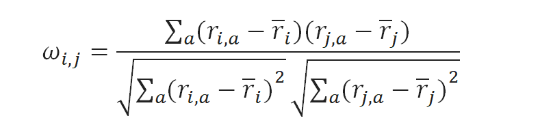

$$\backslash n$$где $${\overline{r}}_{i}$$ — средний рейтинг, выставленный
пользователем i. Иногда пользуются так называемой «косинусной похожестью»,
используя косинус угла между векторами:

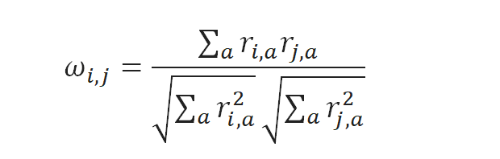

Но для того, чтобы косинус хорошо работал, желательно всё равно сначала вычесть
среднее по каждому вектору, так что в реальности это та же самая метрика. Для
примера рассмотрим какую-нибудь матрицу оценок.

|        | Film_1 | Film_2 | Film_3 | Film_4 | Film_5 |
|--------|--------|--------|--------|--------|--------|
| User_1 | ?      | 3      | 4      | 5      | 2      |
| User_2 | 3      | 5      | 2      | 2      | 5      |
| User_3 | 5      | 3      |        | 4      | 3      |
| User_4 | 5      | 5      | 5      |        | 4      |
| User_5 | 2      | 3      |        | 2      | 2      |

Подсчитаем для user-based рекомендаций корреляцию между вектором предпочтений
User_1 и остальных участников системы.

|        | User-based корреляция |
|--------|-----------------------|
| User_2 | \-0,8944              |
| User_3 | 0,9449                |
| User_4 | 0,8660                |
| User_5 | 0,9049                |

Мы сейчас привели формулы для user-based рекомендаций. В item-based подходе
ситуация похожая, но есть один нюанс: разные пользователи по-разному относятся к
оценкам, кто-то ставит всем подряд по пять звёздочек («лайкает» все подряд
сайты), а кто-то, наоборот, ставит всем по две-три звёздочки (часто жмёт
«дизлайк»). Для первого пользователя низкий рейтинг («дизлайк») будет гораздо
более информативен, чем высокий, а для второго – наоборот. В user-based подходе
об этом автоматически заботится коэффициент корреляции. А в item-based
рекомендациях, чтобы это учесть, можно, например, вычесть из каждой оценки
средний рейтинг того или иного пользователя, а потом уже подсчитать корреляцию
или косинус угла между векторами. Тогда в формуле для косинуса получится

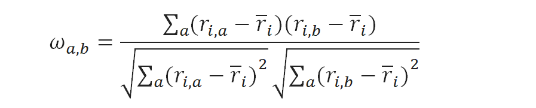

где r обозначает средний рейтинг, выставленный пользователем i. В нашем примере,
если вычесть из каждого вектора оценок среднее, получится вот что:

|        | Film_1 | Film_2 | Film_3 | Film_4 | Film_5 |
|--------|--------|--------|--------|--------|--------|
| User_1 | ?      | \-0,5  | 0,5    | 1,5    | \-1,5  |
| User_2 | \-0,4  | 1,6    | \-1,4  | \-1,4  | 1,6    |
| User_3 | 1,25   | \-0,75 |        | 0,25   | \-0,75 |
| User_4 | 0,25   | 0,25   | 0,25   |        | \-0,75 |
| User_5 | \-0,25 | 0,75   |        | \-0,25 | \-0,25 |

И тогда корреляция между вектором оценок фильма Film_1 и оценками других фильмов
составит (заметим, что с Film_3 сложилась вырожденная ситуация, потому что
пересекающихся оценок было слишком мало)

|        | Item-based корреляция |
|--------|-----------------------|
| Film_2 | \-0,9545              |
| Film_3 | 1                     |
| Film_4 | 0,7870                |
| Film_5 | 0,6689                |

У этих мер похожести есть свои недостатки и разнообразные вариации на тему, но
давайте для иллюстрации методов ими ограничимся. Таким образом, мы разобрались с
первым пунктом плана; на очереди второй – как воспользоваться этими оценками
похожести (весами $$\omega_{i,j}$$)? Простой и логичный подход – приблизить
новый рейтинг как средний рейтинг данного пользователя плюс отклонения от
среднего рейтингов других пользователей, взвешенных этими самыми весами:

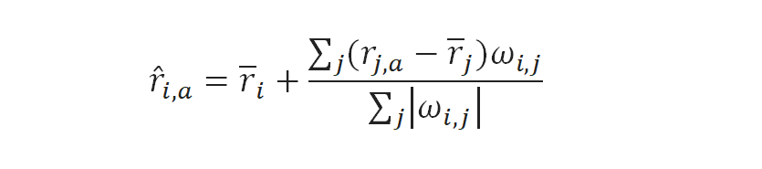

Этот подход иногда ещё называют GroupLens algorithm – так работал дедушка
рекомендательных систем GroupLens – с него когда-то фактически начиналась
серьёзная коллаборативная фильтрация, но и сегодня он может порадовать
малоизвестными фильмами, которые вам понравятся. В случае с User_1 и Film_1 по
этому методу ожидается оценка около 3.9.  
Для item-based рекомендаций всё совершенно эквивалентно – нужно просто найти
взвешенное среднее уже оцененных пользователем продуктов:

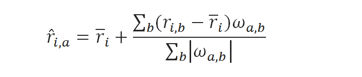

Item-based метод в нашем примере предполагает, что User_1 поставит Film_1 оценку
4.4. Конечно, теоретически всё это хорошо, но в реальности вряд ли получится для
каждой рекомендации суммировать данные от миллионов пользователей. Поэтому эту
формулу обычно огрубляют до k ближайших соседей – k пользователей, максимально
похожих на данного пользователя и уже оценивших этот продукт:

Остается только понять, как быстро искать ближайших соседей. Это уже выходит за
рамки нашего обсуждения, поэтому просто назовем два основных метода: в больших
размерностях можно пользоваться k-d-деревьями, а в больших размерностях выручит
локально-чувствительное хеширование.  
Таким образом мы рассмотрели простейшие рекомендательные алгоритмы, которые
оценивают степень сходства пользователя (продукта) на других пользователей
(другие продукты), а потом рекомендует, исходя из мнения ближайших соседей по
этой метрике. Не следует, кстати, думать, что эти методы окончательно устарели –
для многих задач они прекрасно работают. Однако далее мы перейдём к более
тонкому анализу имеющейся информации.

Виды рекомендательных систем: SVD фильтрация
--------------------------------------------

SVD (Singular Value Decomposition), переводится как сингулярное разложение
матрицы. В теореме о сингулярном разложении утверждается, что у любой матрицы 𝐀
размера 𝑛×𝑚 существует разложение в произведение трех матриц: 𝑈, Ʃ и 𝑉𝑇:

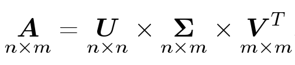

Матрицы 𝑈 и 𝑉 ортогональные, а Ʃ — диагональная (хотя и не квадратная).

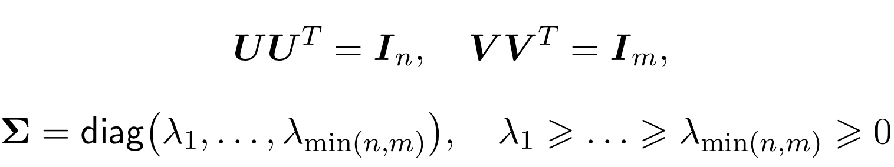

Причем лямбды в матрице Ʃ будут упорядочены по невозрастанию. Помимо обычного
разложения бывает еще усеченное, когда из лямбд, остаются только первые 𝑑 чисел,
а остальные мы полагаем равными нулю.

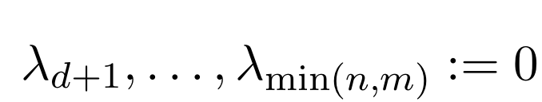

Это равносильно тому, что у матриц 𝑈 и 𝑉 мы оставляем только первые 𝑑 столбцов,
а матрицу Ʃ обрезаем до квадратной 𝑑×𝑑.

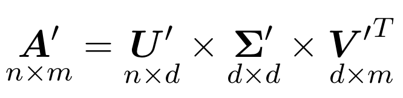

Так вот, оказывается, что полученная матрица 𝐀′ хорошо приближает исходную
матрицу 𝐀 и, более того, является наилучшим низкоранговым приближением с точки
зрения средне-квадратичного отклонения.

**SVD для рекомендаций**

Как же использовать все это для рекомендаций? У нас была матрица, мы разложили
ее в произведение трех матриц. При чем разложили не точно, а приблизительно.
Упростим все немного, обозначив произведение первых двух матриц за одну матрицу:

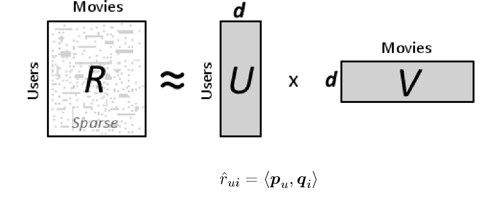

Теперь отвлечемся немного от всех этих матриц и сконцентрируемся на получившемся
алгоритме: чтобы предсказать оценку пользователя 𝑈 для фильма 𝐼, мы берем
некоторый вектор 𝑝𝑢 (набор параметров) для данного пользователя и вектор для
данного фильма 𝑞𝑖. Их скалярное произведение и будет нужным нам предсказанием:

Алгоритм достаточно простой, но дает удивительные результаты. Он не просто
позволяет нам предсказывать оценки. С его помощью мы можем по истории
пользователей выявлять скрытые признаки объектов и интересы пользователей.
Например, может так получиться, что на первой координате вектора у каждого
пользователя будет стоять число, показывающее, похож ли пользователь больше на
мальчика или на девочку, на второй координате — число, отражающее примерный
возраст пользователя. У фильма же первая координата будет показывать, интересен
ли он больше мальчикам или девочкам, а вторая — какой возрастной группе
пользователей он интересен.

Но не все так просто. Есть несколько проблем. Во-первых, матрица оценок *R* нам
полностью не известна, поэтому мы не можем просто взять ее SVD-разложение.
Во-вторых, SVD-разложение не единственное:

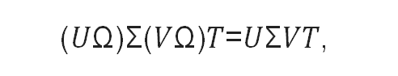

поэтому даже если мы найдем хоть какое-то разложение, вряд ли именно в нем
первая координата будет соответствовать полу пользователя, а вторая – возрасту.

Обучение SVD-разложению матрицы
-------------------------------

Попробуем разобраться с первой проблемой. Тут нам понадобится машинное обучение.
Итак, мы не можем найти SVD-разложение матрицы, т.к. мы не знаем саму матрицу.
Но мы хотим воспользоваться этой идеей и придумать модель предсказания, которая
будет работать сходным с SVD образом. Наша модель будет зависеть от многих
параметров — векторов пользователей и фильмов. Для заданных параметров, чтобы
предсказать оценку, мы возьмем вектор пользователя, вектор фильма и получим их
скалярное произведение:

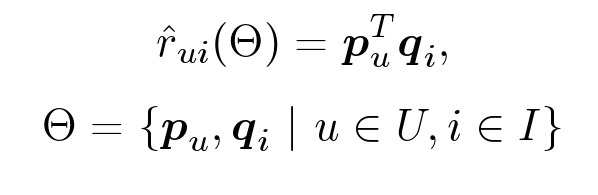

Но так как векторов мы не знаем, их еще нужно получить. Идея заключается в том,
что у нас есть оценки пользователей, при помощи которых мы можем найти такие
оптимальные параметры, при которых наша модель предсказывала бы эти оценки как
можно лучше:

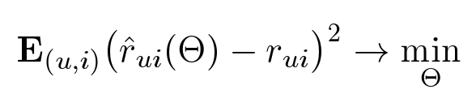

Итак, мы хотим найти такие параметры θ, чтобы квадрат ошибки был как можно
меньше. Но тут есть парадокс: мы хотим меньше ошибаться в будущем, но мы не
знаем, какие оценки у нас будут спрашивать. Соответственно и оптимизировать это
мы не можем. Но нам известны уже проставленные пользователями оценки. Попробуем
подобрать параметры так, чтобы на тех оценках, которые у нас уже есть, ошибка
была как можно меньше. Кроме того, добавим еще одно слагаемое – регуляризатор.

**Обоснование необходимости регуляризатора**

Регуляризация нужна для борьбы с переобучением — явлением, когда построенная
модель хорошо объясняет примеры из обучающей выборки, но достаточно плохо
работает на примерах, не участвовавших в обучении. Вообще, методов борьбы с
переобучением существует несколько, хочется отметить два из них. Во-первых,
нужно выбирать простые модели. Чем проще модель, тем лучше она обобщается на
будущие данные (это похоже на известный принцип бритвы Оккама). А второй метод —
это как раз регуляризация. Когда мы настраиваем модель для обучающей выборки, мы
оптимизируем ошибку. Регуляризация заключается том, что мы оптимизируем не
просто ошибку, а ошибку плюс некоторая функция от параметров (например, норма
вектора параметров). Это позволяет ограничить размер параметров в решении,
уменьшает степень свободы модели.

**Численная оптимизация**

Как же нам найти оптимальные параметры? Нам нужно оптимизировать вот такой
функционал:

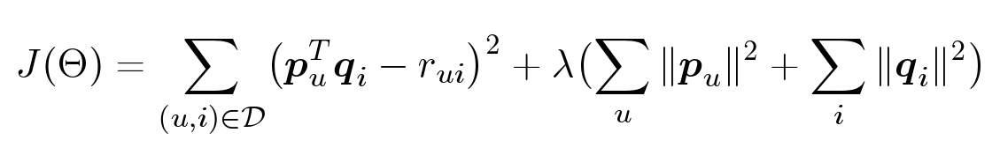

Параметров много: для каждого пользователя, для каждого объекта у нас есть свой
вектор, который мы хотим оптимизировать. У нас есть функция, зависящая от
большого количества переменных. Как найти ее минимум? Тут нам потребуется
градиент — вектор из частных производных по каждому параметру.

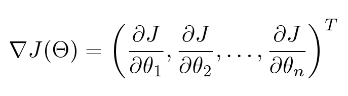

Градиент очень удобно представлять себе визуально. На иллюстрации у нас
изображена поверхность: функция от двух переменных. Например, высота над уровнем
моря. Тогда градиент в какой-нибудь конкретной точке — это такой вектор,
направленный в ту сторону, куда больше всего растет наша функция. А если пустить
воду из этой точки, она потечет по направлению противоположному градиенту.

Самый известный метод оптимизации функций — градиентный спуск. Допустим у нас
есть функция от многих переменных, мы хотим ее оптимизировать. Мы берем
какое-нибудь изначальное значение, а потом смотрим, куда можно двигаться, чтобы
минимизировать это значение. Метод градиентного спуска — это итеративный
алгоритм: он многократно берет параметры определенной точки, смотрит на градиент
и шагает против его направления:

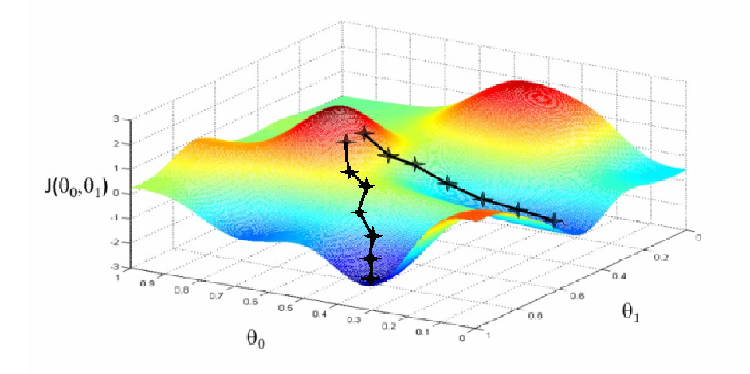

Проблемы этого метода заключаются в том, что он, во-первых, в нашем случае
работает очень медленно и, во-вторых, находит локальные, а не глобальные
минимумы. Вторая проблема для нас не так страшна, т.к. в нашем случае значение
функционала в локальных минимумах оказывается близким к глобальному оптимуму.

**Alternating Least Squares**

Однако метод градиентного спуска применять нужно не всегда. Например, если нам
нужно посчитать минимум для параболы, действовать этим методом необходимости
нет, мы точно знаем, где находится ее минимум. Оказывается, что функционал,
который мы пытаемся оптимизировать — сумма квадратов ошибок плюс сумма квадратов
всех параметров — это тоже квадратичный функционал, он очень похож на параболу.
Для каждого конкретного параметра, если мы зафиксируем все остальные, это будет
как раз параболой. Т.е. минимум по одной координате мы можем точно определить.
На этом соображении и основан метод Alternating Least Squares. Я не буду на нем
подробно останавливаться. Скажу лишь, что в нем мы попеременно точно находим
минимумы то по одним координатам, то по другим:

Мы фиксируем все параметры объектов, оптимизируем точно параметры пользователей,
дальше фиксируем параметры пользователей и оптимизируем параметры объектов.
Действуем итеративно:

Работает все это достаточно быстро, при этом каждый шаг можно распараллелить.

**Измерение качества рекомендаций**

Если мы хотим улучшить качество рекомендаций, нам нужно научиться его измерять.
Для этого алгоритм, обученный на одной выборке — обучающей, проверяется на
другой — тестовой. Netflix предложил измерять качество рекомендаций по метрике
RMSE:

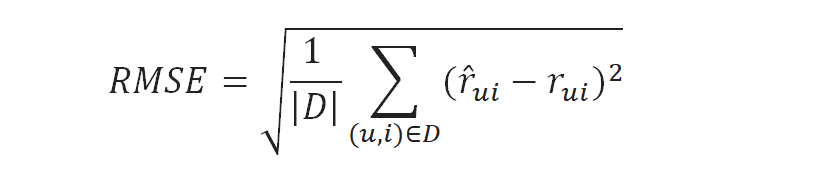

Сегодня это стандартная метрика для предсказания оценки. Однако у нее есть свои
недостатки:

-   У каждого пользователя свое представление о шкале оценок. Пользователи, у
    которых разброс оценок более широкий, будут больше влиять на значение
    метрики, чем другие.

-   Ошибка в предсказании высокой оценки имеет такой же вес, что и ошибка в
    предсказании низкой оценки. При этом предсказать оценку 9 вместо настоящей
    оценки 7 страшнее, чем предсказать 4 вместо 2 (по десятибалльной шкале).

-   Можно иметь почти идеальную метрику *RMSE*, но иметь очень плохое качество
    ранжирования, и наоборот.

**Метрики ранжирования**

Существуют и другие метрики — метрики ранжирования, например, основанные на
полноте и точности. Пусть R — множество рекомендованных объектов, P — множество
объектов, которые на самом деле пользователю понравятся.

Тут тоже есть проблемы:

-   Нет данных про рекомендованные объекты, которые пользователь не оценивал.

-   Оптимизировать эти метрики напрямую почти невозможно.

**Другие свойства рекомендаций**

Оказывается, что на восприятие рекомендаций влияет не только качество
ранжирования, но и некоторые другие характеристики. Среди них, например,
разнообразие (не стоит выдавать пользователю фильмы только на одну тему или из
одной серии), неожиданность (если рекомендовать очень популярные фильмы, то
такие рекомендации будут слишком банальными и почти бесполезными), новизна
(многим нравятся классические фильмы, но рекомендациями обычно пользуются, чтобы
открыть для себя что-то новое) и многие другие.

**Похожие объекты**

Похожесть объектов не такая уж очевидная вещь. К этой задаче могут быть разные
подходы:

-   Похожие объекты — это объекты, похожие по своим признакам (content-based).

-   Похожие объекты — это объекты, которые часто используют вместе («клиенты,
    купившие **𝑖**, также покупали **𝑗**»).

-   Похожие объекты — это рекомендации пользователю, которому понравился данный
    объект.

-   Похожие объекты — это просто рекомендации, в которых данный объект выступает
    в качестве контекста.

Заключение 
-----------

#### Решение задач, связанных с теоритическим построением и реализацией полного функционала рекомендательных систем, достаточна сложна и не тривиальна, но математические наработки сравнительно недавнего времени позволяет в их успешном решении. Сегодня сложно представить большой интернет магазин или медийный сервис без подобного рода систем. И с уверенностью можно сказать что в бедующем доля интернет сервисов имеющих в своем расположении сложные интеллектуальные системы будет только расти.

Список литературы
-----------------

1.  Описание механизмов работы рекомендательных систем Амазаон. [Электронный
    ресурс] . – Режим доступа:
    (http://code.sait-dv.ru/2018/10/07/kak-rabotaet-funkciya-amazon-rekomendaciya/)
    Дата доступа: 17.04.2019.

2.  Как работают рекомендательные системы. Лекция в Яндексе. [Электронный
    ресурс] . – Режим доступа: (https://habr.com/ru/company/yandex/blog/241455/)
    Дата доступа: 17.04.2019.

3.  Пишем простую систему рекомендации на примере Хабра. [Электронный ресурс] .
    – Режим доступа: (https://habr.com/ru/post/230155/) Дата доступа:
    17.04.2019.

4.  Рекомендательные системы.user-based, item-based. [Электронный ресурс] . –
    Режим доступа: (https://habr.com/ru/company/surfingbird/blog/139518/) Дата
    доступа: 17.04.2019.
